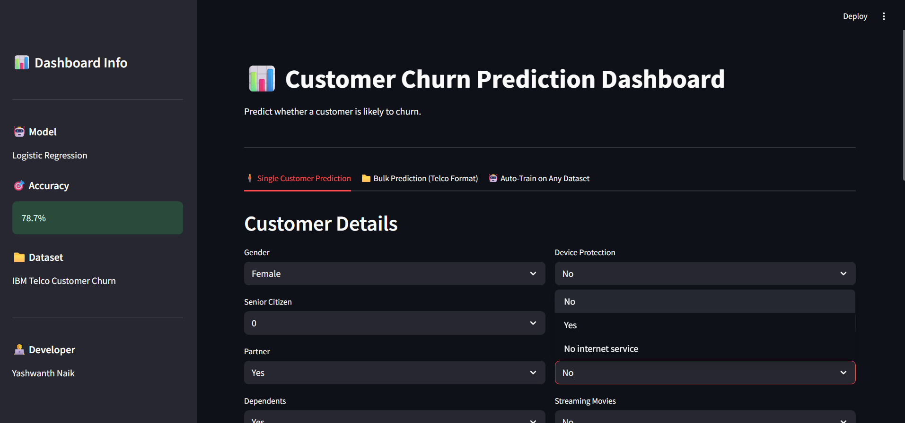
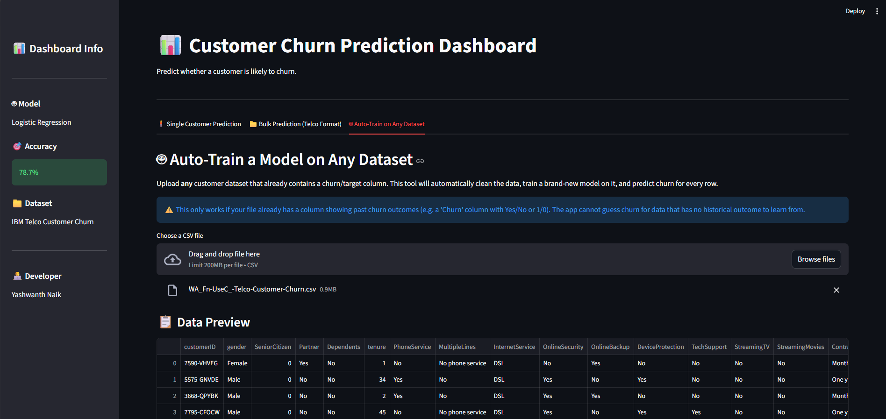
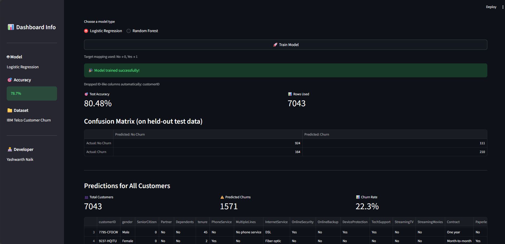
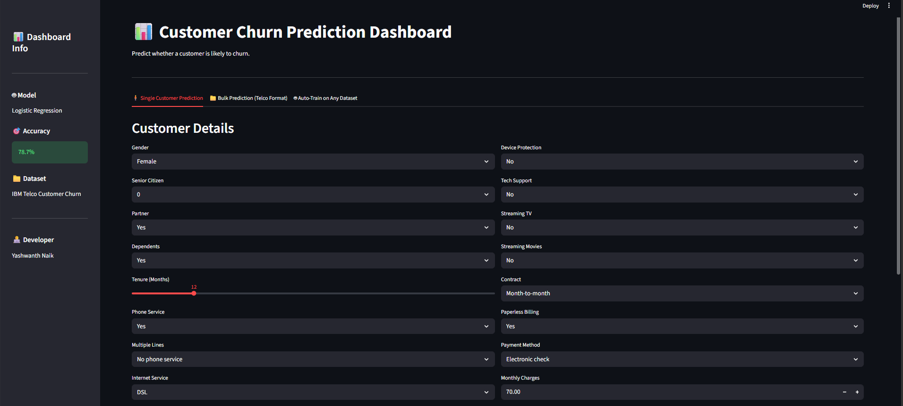
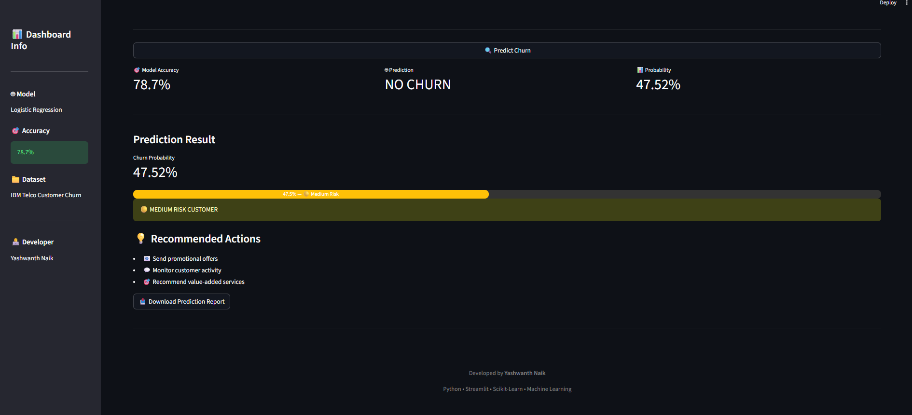
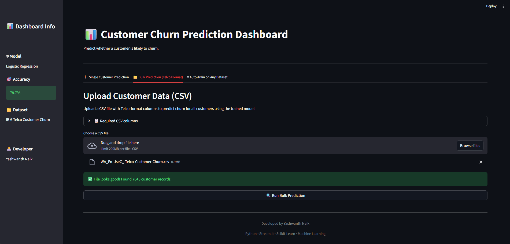
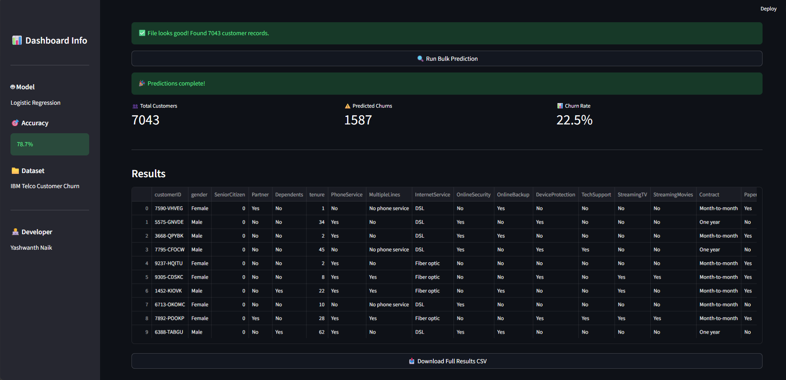
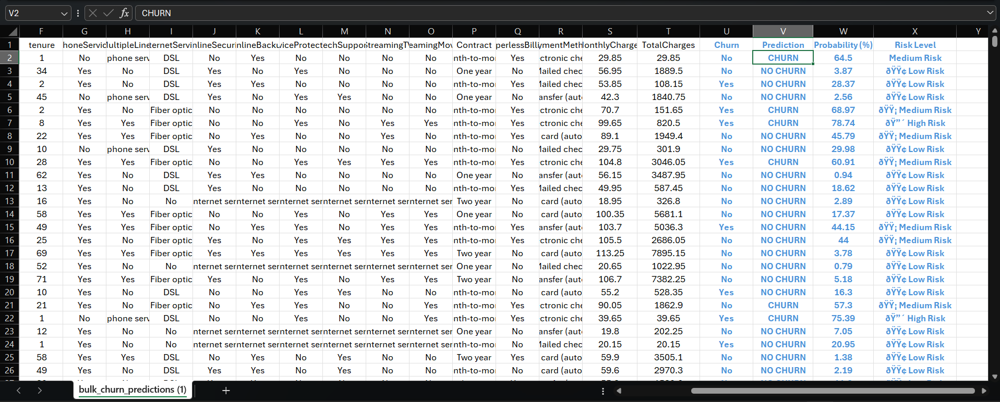

# Churn Sense – Customer Churn Analytics Platform

An end-to-end Machine Learning platform that predicts customer churn using **Logistic Regression** and provides interactive analytics through an intuitive **Streamlit Dashboard**.


---

# Project Overview

Customer churn is one of the biggest challenges faced by telecom companies. ChurnSense helps businesses identify customers who are likely to discontinue their services using Machine Learning.

The platform combines predictive analytics with an interactive Streamlit dashboard that supports single customer prediction, bulk customer analysis, and AutoML model training.

---

# Features

## Single Customer Prediction

- Predict customer churn instantly
- Churn probability score
- Customer risk level analysis
- Business recommendations
- Download prediction report

---

## Bulk Customer Prediction

- Upload CSV files
- Predict churn for multiple customers
- KPI summary dashboard
- Download prediction results

---

## AutoML Training

- Upload any binary classification dataset
- Select target column
- Train Logistic Regression or Random Forest
- View Accuracy & Confusion Matrix
- Download trained model

---

# Dashboard Features

- Interactive Streamlit Dashboard
- Churn Probability Analysis
- KPI Cards
- Risk Segmentation (Low, Medium & High)
- Business Recommendations
- Download Prediction Reports
- Bulk CSV Prediction
- AutoML Training

---

# Tech Stack

| Category | Technologies |
|----------|--------------|
| Programming Language | Python |
| Machine Learning | Scikit-Learn |
| Data Analysis | Pandas, NumPy |
| Visualization | Matplotlib |
| Dashboard | Streamlit |
| Model Storage | Pickle |

---

# Model Performance

| Metric | Value |
|---------|-------|
| Algorithm | Logistic Regression |
| Accuracy | **78.7%** |
| Dataset | IBM Telco Customer Churn |
| Train-Test Split | 80:20 |

---

# Project Structure

```text
ChurnSense/
│
├── app.py
├── requirements.txt
├── README.md
├── churn_model.pkl
├── feature_columns.pkl
│
├── Dataset/
│   ├── customer_churn.csv
│   ├── sample_bulk_prediction.csv
│   └── predicted_results.csv
│
├── Notebook/
│   └── Customer_Churn_Prediction.ipynb
│
├── Screenshots/
│   ├── home_dashboard.png
│   ├── auto_train.png
│   ├── auto_train_result.png
│   ├── single_prediction.png
│   ├── single_prediction_result.png
│   ├── bulk_prediction.png
│   ├── bulk_prediction_result.png
│   └── predicted_result.png
│
└── .streamlit/
    └── config.toml
```

---

# Dashboard Preview

## Home Dashboard

<h2> Home Dashboard</h2>


<h2> Model Training</h2>



<h2> Single Customer Prediction</h2>



<h2> Bulk Customer Prediction</h2>



<h2> Predicted Results Dataset</h2>


---

# Installation

Clone the repository

```bash
git clone https://github.com/your-username/ChurnSense-Customer-Churn-Analytics-Platform.git
```

Move into the project directory

```bash
cd ChurnSense-Customer-Churn-Analytics-Platform
```

Install dependencies

```bash
pip install -r requirements.txt
```

Run the Streamlit application

```bash
streamlit run app.py
```

---

